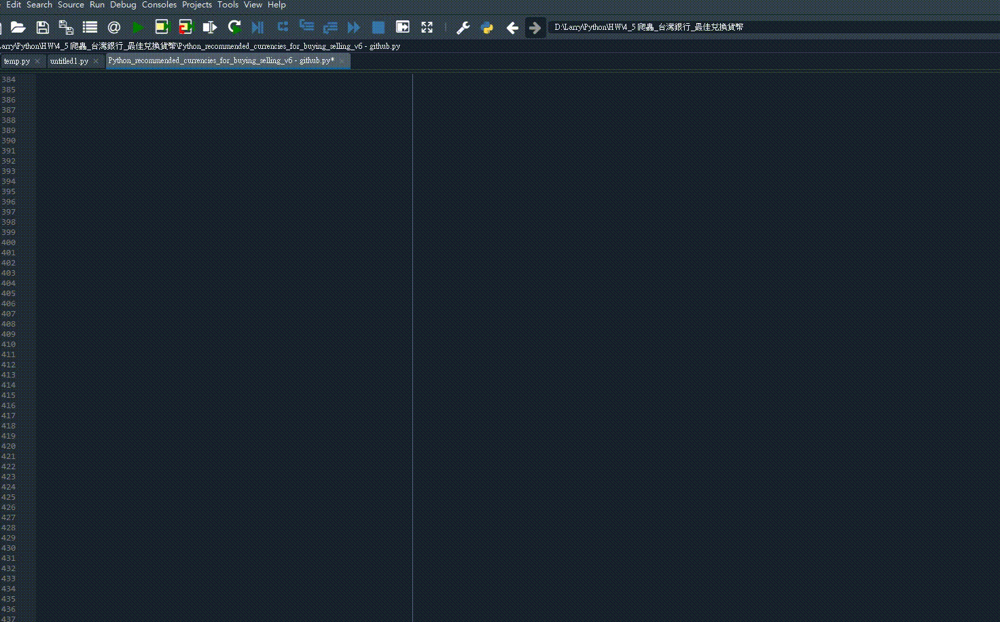
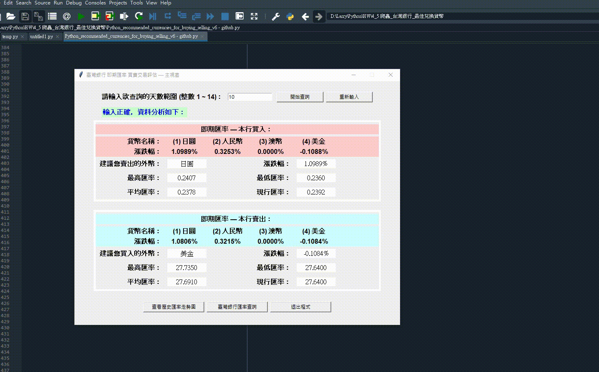
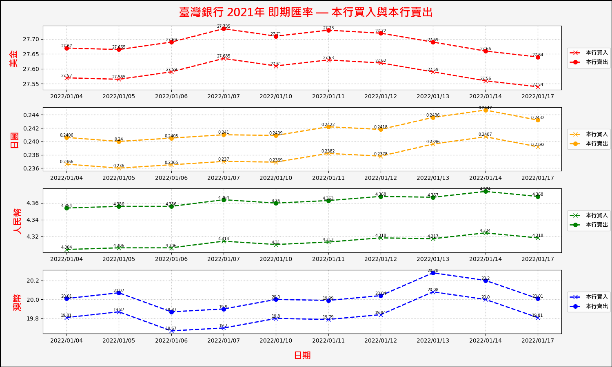
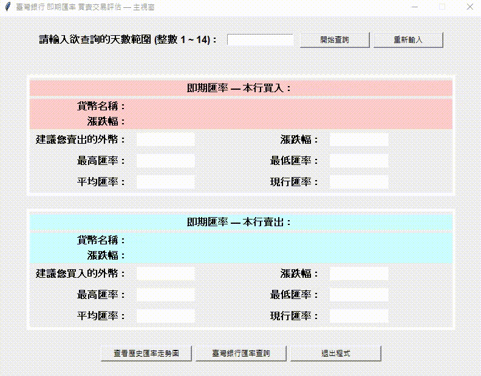
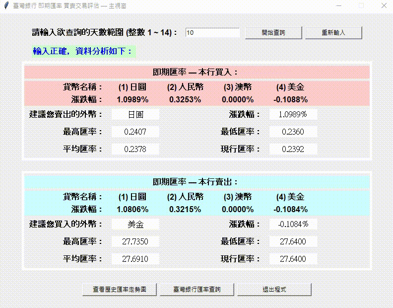

<h1 align="center">
  <br>
  [指定專題作品] 買入與賣出外幣的推薦系統 (網路爬蟲應用2)
</h1>


## 目錄
* [摘要](#摘要)
* [重點程式碼說明](#重點程式碼說明)
* [系統環境](#系統環境)
* [聯絡資料](#聯絡資料)
* [致謝](#致謝)
* [權限](#權限)


## 摘要
### 1. 本作品內含網路爬蟲相關技術 (urllib.request/bs4)，可自動擷取目前臺灣銀行之即時的外匯資料。
### 2. 設計圖形化介面的操作面板。
### 3. 主要功能為：輸入欲查詢的天數，面板將顯示分析後的資料，並推薦適合買入與賣出的貨幣給使用者參考。
### 3. 附加功能為：(1)繪出分析後的歷史外匯走勢圖並儲存於資料夾中 (2)協助導覽至臺灣銀行外匯網頁。



<strong><em>若您有興趣想更了解此程式，請參考下方的聯絡方式，進一步聯絡作者，謝謝參閱。</em></strong>


## 重點程式碼說明
### 1. 本作品內含網路爬蟲相關技術 (urllib.request/bs4)，可自動擷取目前臺灣銀行之即時的外匯資料。
* 於臺灣銀行外匯網頁，檢視網頁程式碼，找到需要擷取的類別資料，取得特定貨幣的日期與匯率
* 外匯相關資料，請參考臺灣銀行網站：https://rate.bot.com.tw/xrt?Lang=zh-TW
  ```python
  for URL_index in range(貨幣種類):
    html_page = urllib.request.urlopen(貨幣網址)
    ⋮
    dates_in_source_codes = sp.select(日期, limit = input_days)
    spot_rates_codes = sp.select(匯率, limit = input_days * 2)
    ⋮
  ```
  
* 從爬蟲獲取的外匯資料中，擷取日期與買入與賣出的即期匯率
  ```python  
  for row_index in range(len(dates_in_source_codes)):
    date_without_year = dates_in_source_codes[row_index].text.replace('2021/', '')
    ⋮
  for row_index in range(0, len(spot_rates_codes), 2):
    buying_spot_rates.append(float(spot_rates_codes[row_index].text))
    selling_spot_rates.append(float(spot_rates_codes[row_index + 1].text))
    ⋮
  ```
  
* 從擷取的即期匯率中，依序分析四種貨幣匯率，根據匯率漲跌幅的高低，降序排列貨幣與資料的序位
* 範例 [('澳幣', [最大值, 最小值, 平均值, 初始值, 現行值, 漲跌]), ('美金', [...]), ('人民幣', [...]), ('日圓', [...])]
  ```python
  ⋮
  sorted_buying_spot_rates = sorted(buying_spot_rate_data.items(), key = lambda x: x[1][5], reverse = True)
  sorted_selling_spot_rates = sorted(selling_spot_rate_data.items(), key = lambda x: x[1][5], reverse = True)
  ⋮
  ```
  
### 2. 使用 Tkinter 模組，產生圖形化介面的操作面板，方便使用者檢視與操作。
* 設計的操作面板具有分析資料 / 清除資料 / 檢視歷史外匯走勢圖 / 導覽臺灣銀行網站 之功能
  ```python
  def analysis_data():
    ⋮
  def clear_data():
    ⋮
  def check_chart():
    ⋮
  def open_url():
    ⋮
  ```
  
  

### 3. 使用 Matplotlib 模組，將外匯資料繪出歷史外匯走勢圖。
  ```python
  def check_chart():
    plt.figure(figsize = (15, 9), facecolor = 'whitesmoke', edgecolor = 'black', linewidth = 1)
      ⋮
    for index_currency_names in range(currency_amount):
      ⋮
      buying_line = some_buying_spot_rates[index_currency_names]
      selling_line = some_selling_spot_rates[index_currency_names]
      ⋮
      plt.subplot(currency_amount, 1, index_currency_names + 1)
      plt.plot(rate_dates, buying_line, color = plt_colors[index_currency_names], ls = '--', marker = 'x', lw = '2', ms = '7', label = plt_actions[0])
      plt.plot(rate_dates, selling_line, color = plt_colors[index_currency_names], ls = '--', marker = 'o', lw = '2', ms = '7', label = plt_actions[1])
      plt.legend(bbox_to_anchor = (1.1, 0.5), loc = 'right', prop = plt_font)
      ⋮      
      # 新增買入與賣出的資料標籤
      for a, b in zip(rate_dates, buying_line):
        plt.text(a, b, f'{b}', ha = 'center', va = 'bottom', fontsize = 7)
        ⋮
    plt.show() 
  ```
  
  
  
  * 歷史外匯走勢圖
  

### 4. 使用 os 模組，創建資料夾 (創建前先檢查是否存在資料夾) 並儲存圖片 (.png)。
  ```python
  def open_url():
    ⋮
    if not os.path.exists(folder_name): os.mkdir(folder_name)
    plt.savefig(f'{folder_name}/twbank_currency_rates.png')
  ```
  
  

### 5. 使用 webbrowser 模組，協助導覽至目標網站
  ```python
  def open_url():
    webbrowser.get('C:/Program Files/Google/Chrome/Application/chrome.exe % --incognito').open_new_tab(導覽網址)
  ```
  


## 系統環境
### 作業系統
* OS：Windows 7 / 10 (Mac OS、Linux 系統亦可相容)

### 相關套件
* Python 核心：3.10
* Beautiful Soup：4.9


## 聯絡資料
👤 **Larry Jhuang**
  * Email: larry30500@gmail.com


## 致謝
*非常感謝指導老師 (Francesco Ke) 提供程式設計的靈感和方向，並細心指導學生編寫程式時，所需注重的細節。*

*如果您喜歡此專案，記得點擊⭐️支持作者。*


## 權限
目前設定為 MIT 權限。請參閱 `LICENSE`，了解更多相關 MIT 權限的規定。

<br><br>[返回目錄](#目錄)
